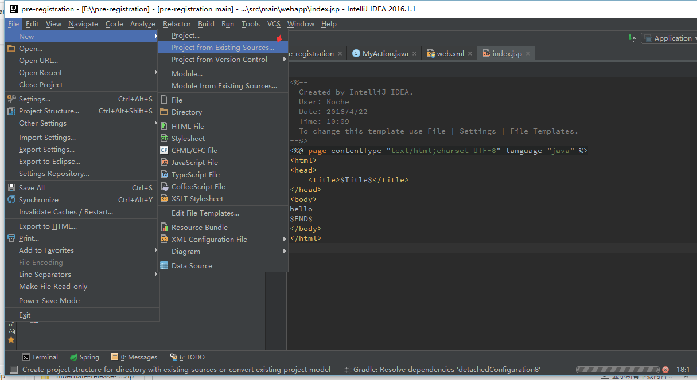
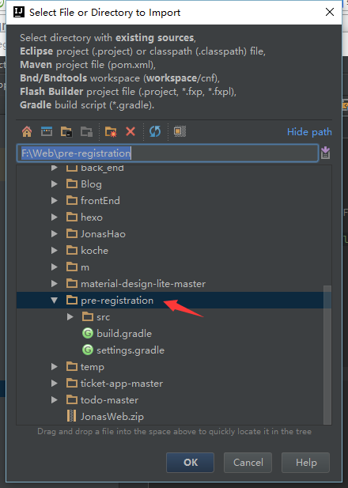
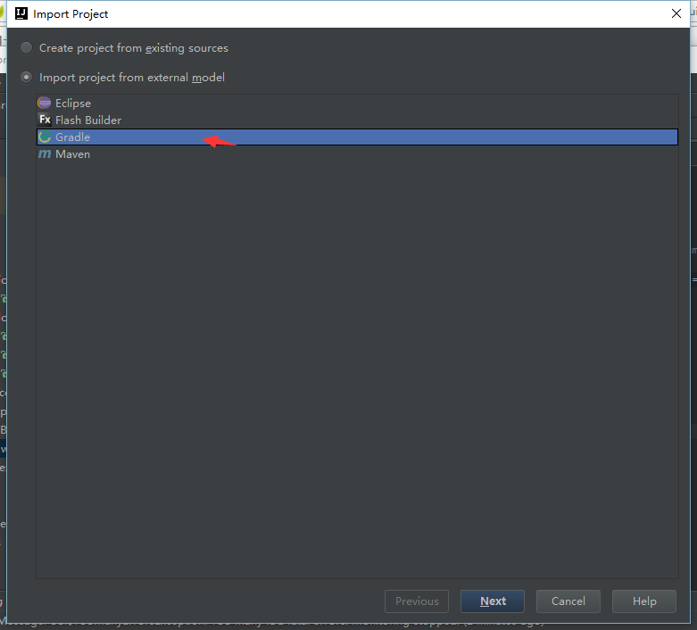
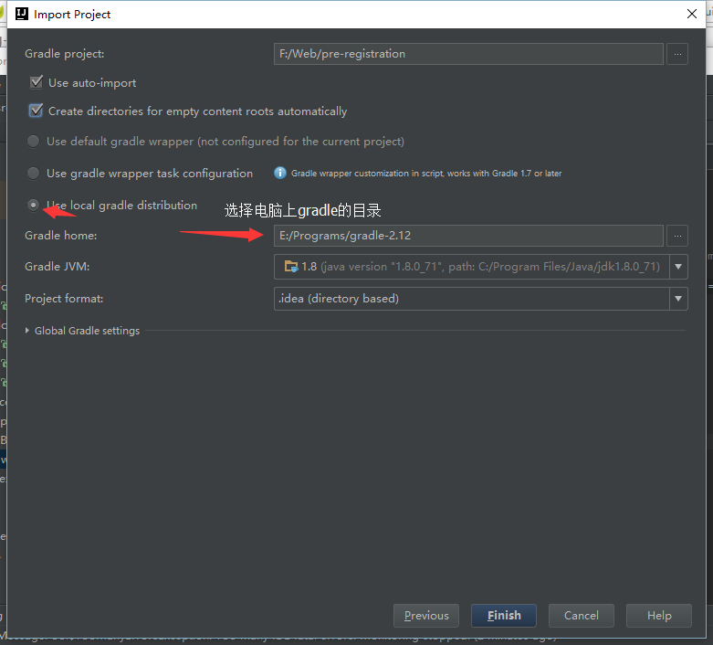

# Pre-registration
在线挂号系统

## 配置
>请注意，只需安装Intellij，gradle。
>其他部分gradle可以自动配置。

导入项目之前，首先将gradle解压到你想要的目录,
然后参考 配置指导

1. IDE: Intellij 2016.1.1 高级版
2. Gradle: Gradle 2.12
3. JDK: Java SE Development Kit 8 (推荐：8u73)
4. Java EE sdk: Java EE 7 SDK 
5. Tomcat: Apache Tomcat 9.0.0.M4 

## 下载地址
[Intellij](https://www.jetbrains.com/idea/download/) 高级版

[Gradle](http://gradle.org/gradle-download/) 下载Binary only distribution

[JDK](http://www.oracle.com/technetwork/cn/java/javase/downloads/jdk8-downloads-2133151-zhs.html)

[Java EE](http://www.oracle.com/technetwork/cn/java/javaee/downloads/index.html)

[Tomcat](http://tomcat.apache.org/download-90.cgi)

## 配置指导
### 导入项目

### 选择项目路径（git拉下来的目录下）

### 通过Gradle导入

### 选择本地Gradle

